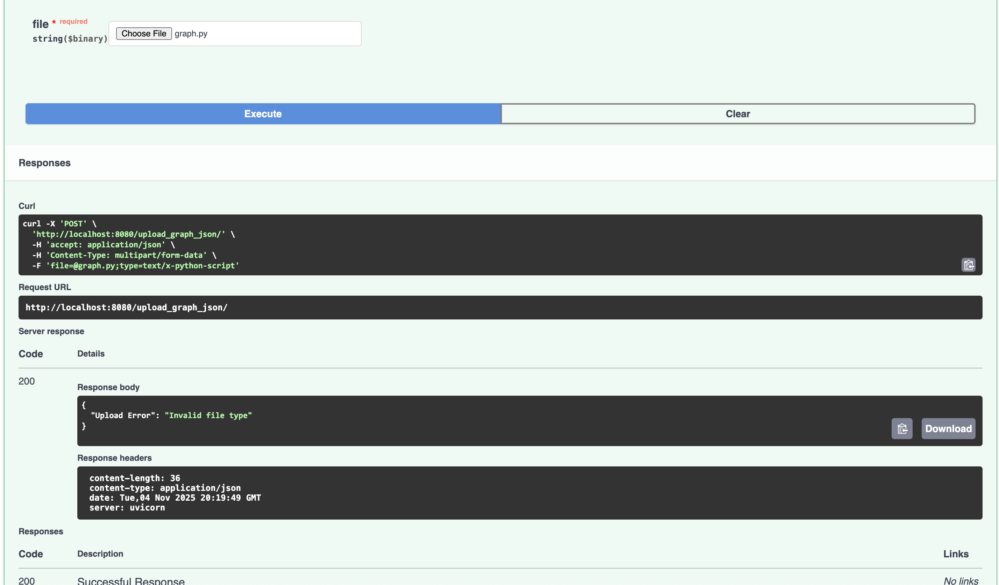
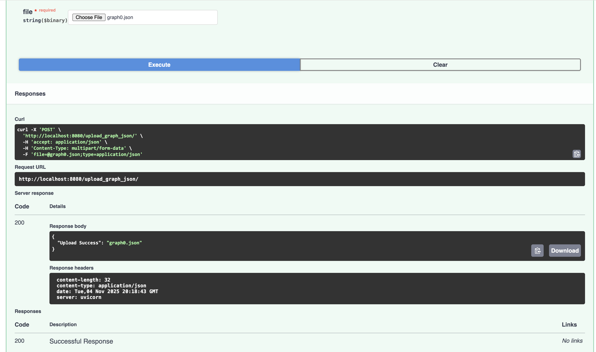
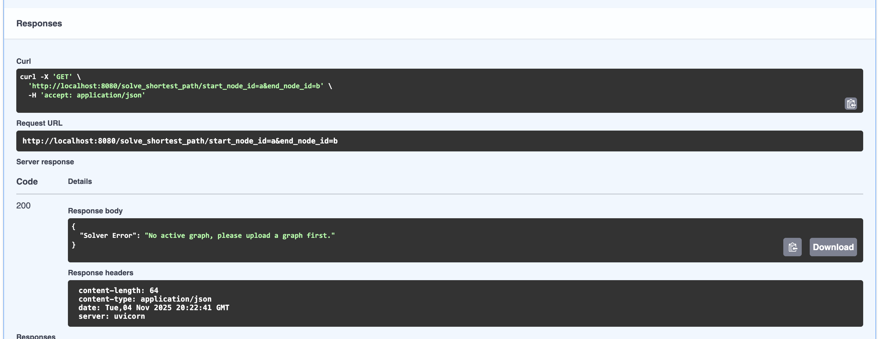
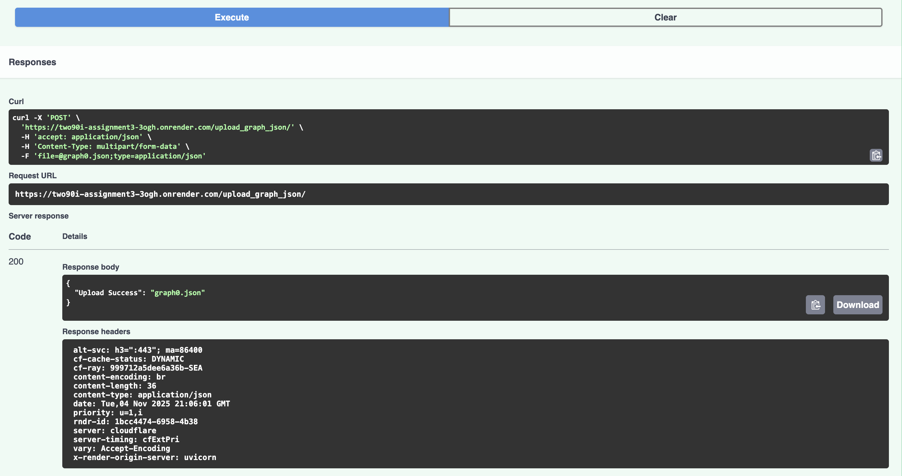

# 290I Assignement 3 

Lazlo Paul

11/4/2025

## Link to Github 

My code is available at: https://github.com/lazlop/290I-Assignment3

## Link to Deployed App on OnRender

My application is deployed at: https://two90i-assignment3-3ogh.onrender.com

I wasn't sure if we should add a "delete_graph" endpoint for you to be able to test the "No active graph failure" 

Please let me know if this should be added or if I need to restart the server so that you can test this failure mode. 

## API Testing Screenshots 

### Graph Upload: Fail

### Graph Upload: Success

### Solve Shortest Path: No Active Graph Fail

### Solve Shortest Path: Invalid Start/End Node Fail

### Solve Shortest Path: Success

### Additional Screenshot: Application running on onrender

